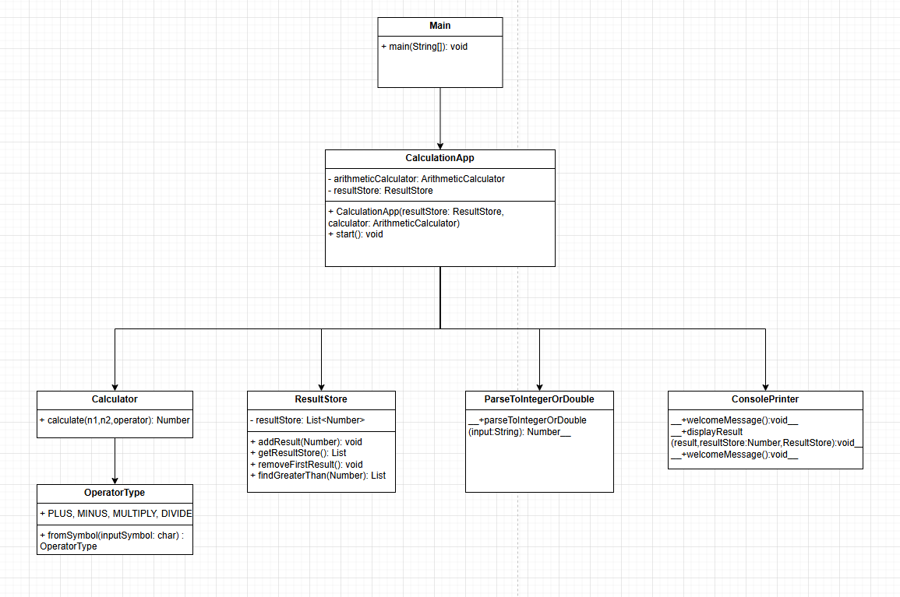
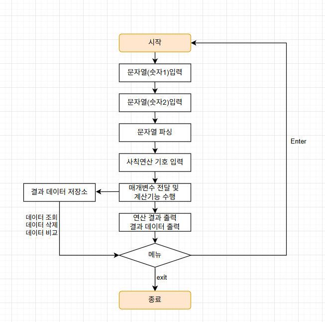

# 📌계산기 프로젝트
___

## 📘프로젝트 소개
1️⃣ 클래스 없이 자바의 기본 문법만을 사용하여 구현한 계산기

2️⃣객체 지향 개념을 적용하여 클래스를 정의한 계산기

3️⃣`Enum` `제네릭` `람다&스트림`을 적용한 계산기  

`README`에서는 3번을 적용하여 리팩토링한 계산기에 대해서 소개하겠습니다.

## 🛠️개발 환경
[](https://skillicons.dev)


## 📂디렉토리
```b
src
├─📁lv1
│    App.java
├─📁lv2
│    App.java
│    Calculator.java
├─📁lv3
│    App.java
│    ArithmeticCalculator.java
│    OperatorType.java
│ 
└─📁lv3ref
     ├─📁app
     │   CalculationApp.java
     │   Main.java
     │
     ├─📁arithmeticcalculator
     │      Calculator.java
     │      OperatorType.java
     │      ResultStore.java
     │
     └─📁util
        ConsolePrinter.java
        ParseToIntegerOrDouble.java
```

## 🚀주요 기능

- 문자열 파싱을 통한 실수와 정수 사칙연산
- 정수끼리의 연산의 결과는 정수(나눗셈은 실수로 반환) 실수끼리의 연산은 실수로 결과 반환
```java
    public static Number parseIntegerOrDouble(String input) {
        if (input.contains(".")) {
            return Double.parseDouble(input);
        }
        return Integer.parseInt(input);
    }
```
```java
========================================
                   계산기                  
========================================
첫 번째 숫자를 입력하세요: 20
두 번째 숫자를 입력하세요: 5
사칙연산 기호를 입력하세요(+ - * /): +
========================================
결과: 25
결과 데이터: [25]
========================================
```
- 명령어
```java
========================================
                   명령어                  
========================================
계속하기: Enter 클릭
값 비교: compare 
오래된 결과 삭제: delete 
모든 결과 삭제: deleteAll 
종료: exit 
명령어를 입력해 주세요: 
```
- 잘못된 입력 예외 처리 (나눗셈 연산에서 분모에 0이 입력되는 경우)
```java
========================================
                   계산기                  
========================================
첫 번째 숫자를 입력하세요: asd
[오류] 잘못된 값입니다. 다시 입력해주세요.
첫 번째 숫자를 입력하세요: 10
두 번째 숫자를 입력하세요: 0
사칙연산 기호를 입력하세요(+ - * /): /
[오류] 나눗셈 연산에서 분모(두번째 정수)에 0이 입력될 수 없습니다.
```

## 💡다이어그램 및 순서도
### `다이어그램`

### `순서도`


## 🔥더 자세한 내용은 아래 블로그 글을 참고 바랍니다 !

<div align="center">
<a href="https://siwon0726.tistory.com/74"></a>
</div>